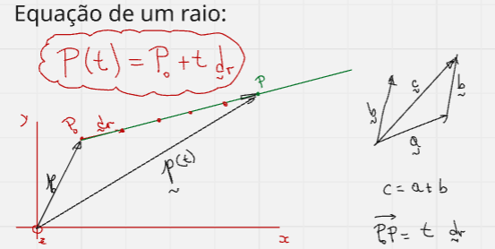

## Aula 2 - interseção de um raio em plano e esfera

A equação do raio é dada por 

$$P(t) = P_0 + t \cdot d$$

- Em que $P_0$ é o ponto de partida do raio.
- ***d*** é o vetor que indica a direção e o sentido do raio.
- t é um escalar que indica a distância do ponto $P_0$ ao ponto $P(t)$ em relação ao comprimento de d. Ou seja, t indica quantas vezes o comprimento de d deve ser multiplacado para obter a distância entre os dois pontos. 

    

Beleza tendo a equação do raio definida, devemos estudar como ele interage com outras entidades. 

### Interseção de Raio - Plano

Seja a equação do plano,

$$(P-P_{pl}) \cdot n = 0$$

- $P$ é um ponto qualquer do plano

- $P_{pl}$ é um ponto específico do plano 

- ***n*** é o vetor unitário perpendicular ao plano.

Para calcular o ponto de interseção entre um raio e um plano, devemos substituir a equação do raio no $P$ da equação do plano. Isso resulta em 

$$t_{int} = \frac{(P_{pl} - P_0)\cdot n}{d\cdot n}$$

- Nisso, para obter o ponto de interseção, $P_{int}$, basta aplicar $t_{int}$ na equação do plano, obtendo o seguinte resultado:

$$P_{int} = P(t_{int}) = P_0 +t_{int} \cdot d$$

### Interseção Raio-Esfera

Seja a equação da esfera,

$$(P-C) \cdot (P-C) = R^2$$

- $P$ é um ponto qualquer
- $C$ é o centro da esfera 
- $R$ é o raio da esfera

Se considerarmos $(P-C)$ como, o vetor que sai o do centro da esfera e vai a um ponto qualquer, temos que seu comprimento, ou norma, é igual ao raio ao quadrado, ou seja,

$$||P-C||^2 = R^2$$

Para calcular o ponto de interseção, mais uma vez a gente precisa substituir a equação do raio no ponto $P$ da equação da esfera. Substituindo a gente obtém,

$$(P_0 + t_{int}d - C)\cdot (P_0 + t_{int} d-C) = R^2$$

Assim como no caso do plano, a gente precisa encontrar o valor de $t_{int}$ para então obter o ponto de interseção. Então, ao desenvolver a conta acima, a gente obtém uma equação do segundo grau em $t_{int}$, 

$$(d \cdot d)t_{int}^2 + 2((P_0 − C) \cdot d) t_{int}^2 + ((P_0 - C)^2 - R^2) = 0$$

Se a gente chamar os fatores de a,b e c a gente tem a equação "simplificada"

$$at_{int}^2 + 2bt_{int} +c = 0$$

Analisando os valores de $\Delta = b^2 - 4ac$ temos que

- Se $\Delta < 0$, não o raio não intersecta com a esfera.
- Se $\Delta = 0$, o raio intersecta com a esfera em um ponto.
- Se $\Delta \geq 0$, o raio intersecta com a esfera em 2 pontos.

Lembrando que para equações do segundo grau, temos

$$t_{int} = \frac{-b\pm \sqrt{b^2-4ac}}{a}$$
    
Por fim, basta substituir o(s) valor(es) de $t_{int}$ na equação do plano, obtendo

$$P(t_{int}) = P_0 + t_{int}d$$