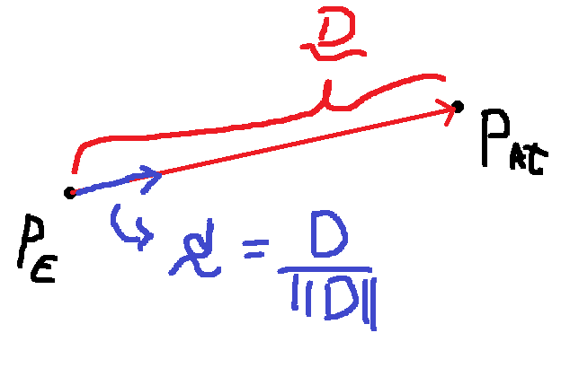
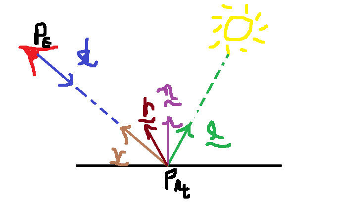

## AP1 CG1 - 2025.2
- Aluno: Lucas Rodrigues Aragão 
A = 5, B = 3, C = 8, D = 3 , E = 9, F = 0
k = (300  + 5 + 3 + 8 + 3 + 9 + 0) % 10 = (328) % 10 = 8

## Questão 1 
- Plano: Se manteve na mesma posição

### Anel cilíndrico:
- Centro da base inicial: (0,0,0)
Centro da base final: (92, 208, 0)

- Raio inicial: 1
Raio final:18

- Altura inicial: $||{C_T - C_B}|| = ||(0,1,0) - (0,0,0)|| = 1$ 
Altura final: 165 

- Centro do topo inicial: (0,1,0)
- Centro do topo final: Centro da base final +altura

Ok, com o aumento do raio e altura, claramente foi aplicada uma matriz de escala $S_{cil}$. Além disso, temos o deslocamento do centro da base, ou seja, uma translação $T_{C_B}$. 

Se a base do cilindro está alinhada com o eixo do chão, o aumento do raio é igual ao aumento nos eixos $x$ e $z$. Como temos que o aumento do raio é de 18 vezes, os valores $s_x$ e $s_z$ são iguais a 18. Além disso temos que o aumento em y vai ser igual ao aumento da altura, nesse caso, $s_y = 165$.  Logo a matriz de escala do anel cilíndrico é dada por 

$$S_{cil} = \begin{bmatrix}
18 & 0 & 0 & 0\\
0 & 165 & 0 & 0\\
0 & 0 & 18 & 0\\
0 & 0 & 0 & 1\\
\end{bmatrix}$$

Além disso temos a translação da base, que é dada pelo deslocamento $C_{inicial} \rightarrow C_{final} = (92,208, 0)$, já que o ponto original era na origem do sistema de coordenadas. Logo, a matriz de translação do anel cilindrico é dada por:

$$T_{Cil} = \begin{bmatrix}
1 & 0 & 0 & 92\\
0 & 1 & 0 & 208\\
0 & 0 & 1 & 0\\
0 & 0 & 0 & 1\\
\end{bmatrix}$$

Portante temos, a aplicação da escala seguida da translação do objeto, resultando em:
$$Cil_{Final} = T_{cil} S_{cil}$$

### Esfera
- Centro da esfera inicial: (0,0,0)
Centro da esfera final: (92, 208, 155.5)

- Raio da esfera inicial: 1
Raio da esfera final: 28

Assim como no anel cilindrico, a esfera sofre aplicações de escala e translação.

Iniciando pela translação, por se tratar de um ponto inicial na origem, temos como $t_x, t_y$ e $t_z$, os valores do ponto final, (92, 208, 155.5). Logo a matriz de translação do centro da esfera é:

$$T_{esf} = \begin{bmatrix}
1 & 0 & 0 & 92\\
0 & 1 & 0 & 208\\
0 & 0 & 1 & 155.5\\
0 & 0 & 0 & 1\\
\end{bmatrix}$$

A matriz de escala também é bem simples, apenas aplicamos o aumento do raio em todas as direções da esfera. 

$$S_{esf} = \begin{bmatrix}
28 & 0 & 0 & 0\\
0 & 28 & 0 & 0\\
0 & 0 & 28 & 0\\
0 & 0 & 0 & 1\\
\end{bmatrix}$$

Por fim, a sequência aplicada é dada pela equação:

$$Esf_{final} = T_{esf} S_{esf}$$

### Cone de base aberta

- Centro da base inicial: (0,0,0)
Centro da base final: (208, 92, 0)

- Vértice inicial: (1,0,0)

- Raio da base inicial: 1
Raio da base final: 38

- Altura inicial: 1
Altura final: 410

Mais uma vez as transformações aplicadas foram de escala e translação. A escala no eixo X e no eixo Z é dada pelo aumento do raio, enquanto a escala do eixo Y é dado pelo aumento da altura. Com isso, a matriz de escala do cone é vista a seguir,

$$S_{cone} = \begin{bmatrix}
38 & 0 & 0 & 0\\
0 & 410 & 0 & 0\\
0 & 0 & 38 & 0\\
0 & 0 & 0 & 1\\
\end{bmatrix}$$

Enquanto a translação é dada pelo deslocamento do centro da base, (208,92,0). 

$$T_{cone} = \begin{bmatrix}
1 & 0 & 0 & 208\\
0 & 1 & 0 & 92\\
0 & 0 & 1 & 0\\
0 & 0 & 0 & 1\\
\end{bmatrix}$$

Logo, a sequência aplicada é dada pela equação:

$$Cone_{final} = T_{cone} S_{cone}$$

### Pirâmide de base quadrada

- Centro da base inicial: (0,0,0)
Centro da base final: (208,208, 0)

- Vértice inicial: (0,0,1)

- Comprimento das arestas da base inicial: 1
Comprimento das arestas da base final: 5

- Altura inicial: 1
Altura final: 420

Além disso, a pirâmide é rotacionada em um ângulo $\theta = \pi/5$ em relação ao eixo que passa pelo centro da base e pelo vértice. Esse eixo é o eixo z do sistema de coordenadas. 

Logo, as transformações aplicadas são escala, translação e rotação.

Iniciando pela translação, assim como nos casos anteriores, vamos apenas colocar as coordenadas do vetor de deslocamento, que é dado pelo ponto final, já que o inicial é a origem do sistema de coordenadas. Nisso temos, 

$$T_{pir} = \begin{bmatrix}
1 & 0 & 0 & 208\\
0 & 1 & 0 & 208\\
0 & 0 & 1 & 0\\
0 & 0 & 0 & 1\\
\end{bmatrix}$$

As escalas aplicadas no eixo X e Y são relativas ao aumento das arestas, enquanto o aumento no eixo Z é o aumento da altura. Por isso temos, 

$$S_{pir} = \begin{bmatrix}
5 & 0 & 0 & 0\\
0 & 5 & 0 & 0\\
0 & 0 & 420 & 0\\
0 & 0 & 0 & 1\\
\end{bmatrix}$$

Por fim, a matriz de rotação em torno do eixo z é dada pelo ângulo $\theta = \pi/5$,

$$R_z(\pi/5) = \begin{bmatrix}
\cos(\pi/5) & -\sin(\pi/5) & 0 & 0\\
\sin(\pi/5) & \cos(\pi/5) & 0 & 0\\
0 & 0 & 1 & 0\\
0 & 0 & 0 & 1\\
\end{bmatrix}$$

Inicialmente aumentamos, depois rotacionamos e por fim transladamos o objeto, logo a sequência de operações deve ser dada por:

$$Pir_{final} = T_{pir} R_z(\pi/5) S_{pir}$$

## Questão 2

- $\alpha = 8 \% 4 = 0$. 

- $P_E = (500 \cos(\frac{8 \pi}{18}), 500 \sin(\frac{8 \pi}{18}), 250)$, que fazendo as simplificações fica $P_E = (500 \cos(\frac{4 \pi}{9}), 500 \sin(\frac{4 \pi}{9}), 250)$.

- $P_{At} = (208, 208, 0)$

- A primeira coisa a se fazer é calcular o vetor $d$ de direção do raio, para que possamos calcular as interseções do raio com os objetos do cenário. 

    

O vetor $D$ é dado por 

$$D = P_{At} - P_E$$
$$D = (208,208,0) - (500 \cos(\frac{4 \pi}{9}), 500 \sin(\frac{4 \pi}{9}), 250)$$

$$D = (208,208,0) - (86.82, 492.4 ,250)$$
$$D = (121.18, - 284.4 ,-250)$$

Normalizando ele obtemos,

$$d = (0.30, - 0.72, -0.63)$$

Ok, agora já temos os valores para montar a equação do raio, $P(t) = P_E + t *d$.

O que devemos então é encontrar primeiramente qual o objeto que é intersectado pelo raio primeiro, ou seja, qual o objeto que obtém o menor $t$.

### Parte 1
#### Plano
- O plano, tem o ponto conhecido $P_\pi = (0,0,0)$ e normal $n_\pi=(0,0,1)$.

O $t_I$ do raio com o plano é dado por: 

$$t_I = -\frac{w \cdot n}{d \cdot n}$$

- Em que $w = P_0 - P_\pi$. Logo teremos que $w = P_E$
$$t_I = -\frac{(86.82, 492.4 ,250) \cdot (0,0,1)}{ (0.30, - 0.72, -0.63) \cdot (0,0,1)}$$

$$t_I = -\frac{250}{-0.63} = 396.82$$

#### Esfera
- A esfera tem centro = (92, 208, 155.5) e raio = 28.

- O $t_i$ é dado por pela resolução da equação do segundo grau:
    $$at_I^2 + bt_I + c =0$$

Em que $a = d \cdot d = 1$, $b = 2 w \cdot d$, com $w = P_E - C$, e por fim $c = w \cdot w - R^2$. Calculamos o $\Delta = b^2 - 4ac$ para descobrir se o raio intersecta a esfera.
$w = (86.82, 492.4 ,250) - (92, 208, 155.5) = (-5.18, 284.4, 94.5)$. 

Fazendo os cálculos, obtemos que $b \approx 531.71$ e $c \approx 89056.44$. Ao fazermos $\Delta = b^2 - 4ac$, obtemos $\Delta < 0$. Logo, o raio não intersecta a esfera.

#### Anel cilindrico

- O cilindro tem centro da base = (92, 208, 0), raio = 18 e altura = 165.

Assim como no caso da esfera, o $t_I$ é dado pela resolução de uma equação do segundo grau, a diferença aqui é o que cada $a,b,c$ representa:

$$a = d^T M d ;b =2 w M d; c = w^T m w -R^2$$

Em que, o $w = P_E - C_B = ((86.82, 492.4 ,250) - (92, 208, 0)) = (5.18, 284.4, 250)$.

Para obtermos a matriz M, devemos calcular o vetor normalizado direção do cilindro. Que é dado por $D_{cil} = (Topo_{cil} - CentroBase_{cil}) = ((92, 373, 0) - (92, 208, 0) ) = (0, 165, 0)$, normalizando ele obtemos $d_{cil}=(0,1,0)$. 
Com isso a matriz M é dada por $M = I - d_c d_c^T$. A matriz M resultando é

$$M= \begin{bmatrix}
1 & 0 & 0\\
0 & 0 & 0\\
0& 0 & 1 \\
\end{bmatrix}$$

Nisso podemos calcular os valores de $a,b,c$:

$$a = 0.4869; b = 0; c = 62202.83$$
Ao calcular o $\Delta$, obtemos $\Delta \leq0$.  Logo, o raio não intersecta o cilidro.

### Cone de base aberta

- O cone tem centro de base = (208, 92, 0), raio = 38 e altura = 410.

Mais uma vez, o t_I é dado por uma equação do segundo grau, que tem como coeficientes:

$$a = d M^\ast d ; b = 2 w^T M^\ast - 2Hd^T d_{co}; c =w^T M^\ast w - 2H w^T d_{co} + H^2$$. 

Temos que $w = P_E - C_B = ((86.82,492.4,250) - (208, 92, 0)) = (-121.18, 400.4, 250)$. Além disso devemos calcular a direção do cone, $d_{co}$. Como inicialmente, temos que o vértice é (1,0,0) e a base (0,0,0) e, as transformações aplicadas não alteraram a direção do cone, temos que $d_{co} = (1,0,0)$. Com isso, o último item faltante é a matriz $M^\ast$, que é dada por $M^\ast = \bar{M} - (\frac{H}{R})^2 M$, onde $M = I - d_c d_c^T$ e $\bar{M} = d_c d_c^T$. Nisso, obtemos 

$$M= \begin{bmatrix}
0 & 0 & 0\\
0 & 1 & 0\\
0& 0 & 1 \\
\end{bmatrix}$$

$$\bar{M}= \begin{bmatrix}
1 & 0 & 0\\
0 & 0 & 0\\
0& 0 & 0 \\
\end{bmatrix}$$

$$M^\ast= \begin{bmatrix}
1 & 0 & 0\\
0 & -116.41 & 0\\
0& 0 & -116.41 \\
\end{bmatrix}$$

Com isso, podemos calcular os coeficientes da equação:

$$a = -106.46; b = 103472.09; c = -25656953.69$$

Ao calcular o $\Delta$, obtemos $\Delta \leq 0$. Logo o raio não intersecta o cone.

### Pirâmide de base quadrada

- A pirâmide tem centro da base = (208,208,0), arestas da base com comprimento = 5 e altura = 420. 

- Para obter o vértice do topo da pirâmide a gente aplica as transformações da pirâmide no ponto $V_T = (0,0,1)$, obtendo o ponto $V_T{final} = (208,208,420)$.

- Vamos calcular também os vértices da base. A meneira que eu fiz aqui foi, primeiramente encontrar os vértices originais da base, para deo=pois aplicar as transformações. Como o centro da base era na origem e o comprimento das arestas era igual a 1, obtemos que os vértices eram $V_1= (-0.5, -0.5,0), V_2 = (0.5, -0.5, 0), V_3 = (0.5, 0.5,0), V_4 = (-0.5,0.5,0)$. 
- Aplicando as transformações obtemos, $V_1 = (207.44, 204.5, 0), V_2= (211.49, 207.44, 0), V_3 =(208.55, 211.49,0), V_4 = (204.5, 208.55, 0)$.

- Para cada face triangular, o $t_I$ é obtido fazendo 
$$t_I = - \frac{w \cdot n}{d \cdot n}$$

- Então para cada face a gente precisa obter a normal $n$. Para isso a gente vai user o conceito de coordenadas baricentricas, que para cada face triangular $\{ V_1,V_2,V_3 \}$, a gente vai fazer $r_1 = V_2 - V_1$ e $r_2 = V_3 - V_1$, para então calcular $N = r_1 \times r_2$ e $n$, sua versão normalizada.

- Além disso, $w$ é dado por $w = P_E - V_1$

- Depois disso precisamos validar o ponto. Vendo se ele está na face. Para isso a gente vai calcular o ponto $P_I = P_0 + t_I d$. Depois disso a gente calcula os valores das componentes $c_1, c_2, c_3$. Sejam $s_1 = V_1 - P_I, s_2 = V_2 - P_I, s_3 = V_3 - P_I$, temos
$$c_1 = \frac{n \cdot s_3 \times s_1}{||N||}; c_2 = \frac{n \cdot s_1 \times s_2}{||N||}; c_3 = 1 - (c_1 + c_2)$$

Caso algum dos componentes seja menor que 0, o ponto está fora da face. 

Com isso vamos iniciar o processo

#### Face $V_1 V_2 V_T$

Sejam $r_{11} = (V_2 - V_1)$ e $r_{12} = (V_T - V_1)$, temos que a normal, $n_1$ será dada por 

$$n_1 =\frac{r_1 \times r_2}{ ||r_1 \times r_2||} = \frac{(2933.28, -464.58, 0)}{2969.84} = (0.98, -0.15, 0)$$

Além disso, temos que $w = (P_E - V_1) = (-120.62,287.89,250)$, com isso conseguimos obter o ponto $t_I$, dado por 

$$t_I = - \frac{ w \cdot n}{d \cdot n} = - \frac{-164.17}{0.40} = 401.47$$.

Vamos agora validar o ponto encontrado. Colocando ele na equação do raio, obtemos, $P_I = (207.26, 203.33,  -2.92)$. Aplicando ele nas fórmulas, obtemos os seguintes valores das componentes:
$$c1: -0.66, c2: -0.003, c3: 1.67$$

Como existem valores menores que 0, o raio não intersecta a face. 

#### Face $V_2 V_3 V_T$

Sejam $r_{12} = (V_3 - V_2)$ e $r_{12} = (V_T - V_2)$, temos que a normal, $n_2$ será dada por 

$$n_2 =\frac{r_1 \times r_2}{ ||r_1 \times r_2||} = \frac{(1698.93, 1234.34,12.5)}{2100.04} = (0.81, 0.58, 0.01)$$

Além disso, temos que $w = (P_E - V_2) = (-124.67, 284.95, 250)$, com isso conseguimos obter o ponto $t_I$, dado por 

$$t_I = - \frac{ w \cdot n}{d \cdot n} = - \frac{-68.11}{0.18} = 369.7$$.

Vamos agora validar o ponto encontrado. Colocando ele na equação do raio, obtemos, $P_I = (197.73, 226.21, 17,08)$. Aplicando ele nas fórmulas, obtemos os seguintes valores das componentes:
$$c1: 4.63, c2: 0.04, c3: -3.67$$

Logo, o raio não intersecta a face. 

#### Face $V_3 V_4 V_T$

Como o processo é bastante repetitivo, a partir daqui apenas colocarei os resultados encontrados, sem explicar muito. $r_{13} = (V_4 - V_3)$ e $r_{13} = (V_T - V_3)$. 

$$n_3 = \frac{(-1234.34, 1698.93, 12.5)}{2100.03} = (-0.58, 0.80, 0.005)$$

$w = (P_E -  V_3) = (-121.73, 280.9 ,250)$, tendo $tI = 393.79$ e por isso, 
$$P_I = (204.95, 208.86, 1.90)$$

Com isso obtemos, os valores de componente 
$$c_1 =  0.88; c_2: 6.30 \times 10^{-5}; c_3= 0.11$$

Portanto o raio intercepta a face. 

#### Face $V_4 V_1 V_T$

Nesse caso temos, $r_{14} = (V_1 - V_4)$ e $r_{14} = (V_T - V_4)$.

$$n_4 =  \frac{( -464.58, -2933.28, 0)}{2969.84} = (-0.15, -0.98, 0)$$

$w = (P_E -  V_4) = (-117.68, 283.84, 250)$, tendo $tI = 394.36$ e por isso, 

$$P_I = (205.1306409  208.45446183   1.54765411)$$

Por fim, obtemos as componentes 

$$c_1 = -0.90, c_2, -0.0018, c_3 = 1.91$$

Por isso, o raio não intersecta a face.

#### Face 1 da base $V_1 V_2 V_3$

Para a base quadrada, dividi ela em 2 faces. Uma com os vértices $V_1 V_2 V_3$ e outra com $V_1 V_3 V_4$. As contas seguem o mesmo raciocínio. 

$r_{15} = (V_2 - V_1)$ e $r_{15} = (V_3 - V_1)$.

$$n_5 = \frac{( 0.  0. 25)}{25} = (0,0,1)$$

$w = (P_E -  V_1) = (-120.62, 287.89, 250)$, tendo $tI = 396.82$, levando a 

$$P_I = (205.86, 206.68, 0)$$

Finalmente obtemos as componentes 
$c_1 = -0.53; c_2, 0.53; c_3 = 0.99$$

Dessa forma, o raio não intersecta a face. 

#### Face 2 da base $V_1 V_3 V_4$

A última checagem. 

$r_{16} = (V_3 - V_1)$ e $r_{16} = (V_4 - V_1)$.

$$n_6 = \frac{( 0.  0. 25)}{25} = (0,0,1)$$

$w = (P_E -  V_1) = (-120.62, 287.89, 250)$, tendo $tI = 396.82$, levando a 

$$P_I = (205.86, 206.68, 0)$$

Por último, obtemos os componentes 
$$c_1 = 0.0004; c_2, 0.53; c_3 = 0.46$$

A face é interceptada pelo raio. 

#### Resposta parte 1

Apenas 3 "objetos" são atingidos pelo raio. O plano do chão, uma face lateral da pirâmide e uma parte da base da pirâmide. A escolha então, deve ser daquele que possui o menor $t_I$. Sendo este, a face lateral da pirâmide, formada pelo vértices $V_3 V_4 V_T$.

### Parte 2 - cálculo da energia 

- Dada a fonte pontual $P_F$, posicionada em (300,300,1000) e com intensidade (1,1,1). Devemos determinar a energia que chega no olho do observador partindo do ponto $P_{At}$. Considerando que o material do objeto é dado pelos coeficientes $(k_{rD}, k_{gD}, k_{bD}) = (k_{rE}, k_{gE}, k_{bE}) = (0.5, 0.25, 0.5)$ e que o coeficiente de polimento do material é $e=2$. O cálculo da energia deve levar em conta os componentes da figura abaixo.
    
    

De modo que a $I_E$, ou seja a intensidade de energia que chega no olho do observador é dada por:

$$I_E = I_F \odot K_D F_D + I_F \odot K_E F_E$$

Onde, $F_D = \max(0, l \cdot n)$ e $F_E = \max(0, (r \cdot v)^e)$. E os vetores são dados por $v = -d$, $l = (P_F - P_{At})/||P_F - P_{At}||$, $r = 2 (n \cdot l) n - l$ e $n$ é a normal.

Sendo a normal encontrada antes, a normal da face lateral da pirâmide de base quadrada, dada por 

$$n_3 = \frac{(-1234.34, 1698.93, 12.5)}{2100.03} = (-0.58, 0.80, 0.005)$$

E o vetor direção de $P_E$ à $P_{At}$: 
$$d = (0.30, - 0.72, -0.63)$$

Por consequência obtemos, $v = (-0.3, 0.72, 0.63)$. O cálculo de $l$ é dado por 
$$l = \frac{(P_F - P_{At})}{||P_F - P_{At}||} = \frac{(92,92,1000)}{1008.42} = (0.09, 0.09, 0.99)$$.

Com isso, conseguimos calcular o vetor $r$:
$$r = 2 (n \cdot l)n - l = (-0.04, -0.04, -0.94)$$

Dessa forma, conseguimos calcular os valores de $F_D$ e $F_E$. 

$$F_D = \max(0, l \cdot n) = \max (0, 0.02) = 0.02$$
$$F_E = \max(0, (r \cdot v)^e) = \max (0,(-0.61)^2) = \max(0, 0.37) = 0.37$$

Nisso temos todos os elementos para calcular a intensidade da luz que chega no olho do observador:

$$I_E = I_F \odot K_D F_D + I_F \odot K_E F_E$$

$$I_E = (1,1,1) \odot (0.5, 0.25, 0.5) \cdot 0.02 + (1,1,1) \odot (0.5, 0.25, 0.5) \cdot 0.37$$

$$I_E = (0.195, 0.0975, 0.195)$$

Logo a energia RGB que chega na energia do observador, desconsiderando sombras, é dada pelas componentes $I_E = (0.195, 0.0975, 0.195)$.